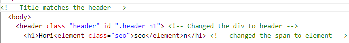
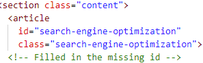
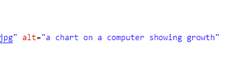
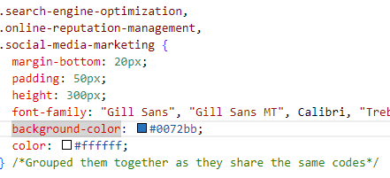

# Challenge-One-UTA

## First Bootcamp Challenge
**Making the website accessible**

The main changes in HTML was in changing the semantics for example *div* to *header*, *nav*, etc. One of the nav link was not properly linked as it was missing the id. Added the id to make it work. I also added a alt note on all the 
images provided.

The main changes in CSS was in omitting the repeated class and merging them into one.

Link to the website: https://kaidoll.github.io/Challenge-One-UTA/ 